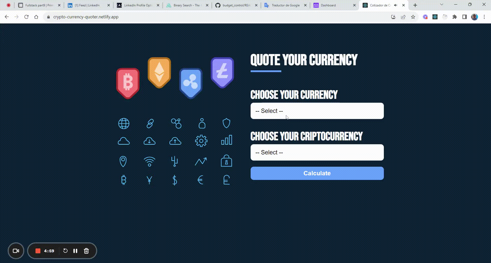

# Cryto Currency

> This is an app made with React.js that queries the current status of the value of a coin to a cryptocurrency through an API and custom hooks..

## Desktop Preview



## Live Version 

[Please click here](https://crypto-currency-quoter.netlify.app/)

## Built With

- HTML/SCSS and JavaScript
- React JS
- Emotion Styles
- Custom Hooks

## Getting Started

To get a local copy up and running follow these simple example steps.

- Clone this repository with git clone```https://github.com/oliverSCZ/cryptocurrency-quoter.git``` using your terminal or command line.

### Prerequisites

You need to make sure to have installed the latest version of Node.js and npm on your computer.

### Setup

You can clone this repository or simply download the files as a .zip
If you want to set up a personal repository based on this one, you can as well fork it.

### Install

After clone it and before working on it, you have to run ```npm install``` so that all the dependencies of the project get downloaded in your pc locally.   
   
### Usage

You're free to use this project however you like it for educational purposes. Just keep in mind the acknowledgment described below

To work on the project, run ```npm start``` in your terminal to deploy a live version of the development. This works in watch mode so it automatically reloads any need change you make to the files. 


## Deployment

Netlify is set to automatically deploy the production branch (main branch) of this project, so you don't need to worry about it.

## Author

👤 **J. Oliver Coimbra Medina**

- GitHub: [@oliverSCZ](https://github.com/oliverSCZ)
- LinkedIn: [Oliver](https://www.linkedin.com/in/oliver-coimbra/)

## Acknowledgments

## Show your support

Give a ⭐️ if you like this project!

## 📝 License

This project is [MIT](./MIT.md) licensed.